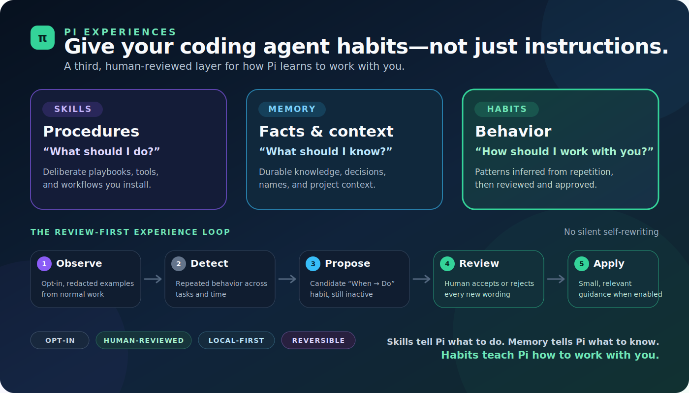

# Pi Experiences — habits for a coding agent that learns how you work

**Give your Pi coding agent a third kind of long-term improvement: human-reviewed habits.**

Agent skills teach procedures. Agent memory preserves facts and context. **Experience helps Pi learn how you prefer to work**—from direct conversation or repeated interaction, through explicit review, without silently rewriting itself.

`pi-experiences` is a local-first Pi extension and skill for persistent behavioral learning and coding-agent personalization. Tell Pi a habit directly and confirm its exact wording, or ask Analyze to turn repeated patterns into candidate habits. Nothing becomes active without your explicit approval.



> **Skills tell Pi what to do. Memory tells Pi what to know. Habits teach Pi how to work with you.**

## The missing layer in AI agent improvement

Most AI agent improvement falls into two buckets:

- add more instructions;
- remember more context.

Both matter. Neither captures the small behavioral corrections that make collaboration improve over time: ask before guessing, show evidence before claiming success, lead with rollback for risky changes, or report status in the format a person actually uses.

Humans call those patterns **habits**. Pi Experiences gives them their own reviewed lifecycle instead of hiding them inside prompts or mixing them with facts.

| Layer | The question it answers | How it gets there | Example |
| --- | --- | --- | --- |
| **Agent skill** | “What procedure can I follow?” | Deliberately written or installed | “Use this release checklist.” |
| **Agent memory** | “What should I remember?” | Explicitly saved as durable knowledge | “This repository publishes from `main`.” |
| **Experience habit** | “How should I tend to behave?” | Declared directly or inferred from repetition, then reviewed by you | “Verify the packed artifact before calling a release ready.” |

This is the third layer: not more commands, not another fact store, but **human-in-the-loop behavioral learning**.

## Why not put every preference in `profile.md`?

A profile file looks simple: keep appending facts, preferences, corrections, and behavioral rules, then load it for the agent. That works while the file is tiny. As an adaptive habit system, it breaks down.

For the model to react to a potentially relevant profile rule, the profile generally has to be placed in context *before* the model knows whether that rule matters. As the file grows, every turn pays for unrelated text—in tokens, attention, latency, and opportunities for stale instructions to collide.

| A growing `profile.md` | Pi Experiences |
| --- | --- |
| Mixes identity, facts, preferences, rules, and behavior in one document | Keeps habits as separate structured, reviewable records |
| Usually loads the whole profile so the model can discover what is relevant | Selects only a small set of relevant, approved habits when reminders are enabled |
| Accumulates permanent context and token cost | Keeps raw history out of the reply path and injects bounded guidance |
| Makes stale or contradictory lines hard to trace | Preserves evidence, freshness, state, and review audit per habit |
| Is awkward to disable one behavior without editing the document | Lets you disable, re-enable, archive, or recheck one habit |
| Depends on manual upkeep | Detects repeated patterns, then asks before activating anything |

**Concrete example:** suppose you correct Pi three times: “Do not call a release complete until you test the packed install.” In a growing profile, that sentence is carried into unrelated conversations about CSS, SQL, or documentation because the model must see it before deciding it is irrelevant. In Experience, it becomes one reviewed release habit. When reminders are enabled, the selector can surface that small habit for release work without loading the raw history or every other habit.

A short `profile.md` can still be useful for stable, deliberately declared identity or preferences. It is the wrong shape for an ever-growing behavioral learning system. **Profiles describe the person; experience manages reviewed habits.**

## Real-life habits Pi can learn

A good habit generalizes across projects and tasks. It changes *how* the agent works, not *what facts* it knows.

| When this keeps happening… | Pi can suggest a habit like… |
| --- | --- |
| **Release claims arrive too early** | “Before calling a release ready, verify the actual packed and installed artifact.” |
| **Ambiguous requests trigger guesses** | “When missing input changes correctness, ask one crisp question before proceeding.” |
| **Risky changes bury the escape route** | “For migrations or destructive changes, explain rollback before implementation.” |
| **Progress updates are vague** | “Report status as done or blocked, include evidence, then state the next action.” |
| **Logs contain more private data than needed** | “When handling sensitive material, minimize raw detail and prefer a safe summary.” |
| **Confident language outruns evidence** | “Before making a technical claim, cite a file, test, command result, or explicit uncertainty.” |

These are not one-off macros. They are reusable behavioral tendencies that can make a coding agent feel less reset between sessions—while keeping the human in charge.

## How the review-first learning loop works

Pi Experiences is a controlled answer to the self-improving-agent problem: let behavior improve, but make every change visible and reversible.

There are two reviewed entry paths:

- **Declare a habit naturally:** discuss a pattern with Pi, let Pi show the exact `When:` / `Do:` wording, then say yes or correct it. Only a later, explicit confirmation saves that exact draft. A declared habit does not need repetition evidence, but current safety law, conflicts, local duplicate checks, stale-state protection, and audit still apply.
- **Learn from repetition:** opt into local examples and manually run Analyze. The repeated-pattern loop remains:

1. **Observe** — after you opt in, Pi stores bounded, heuristically redacted examples from normal work.
2. **Detect** — when you manually start Analyze, your selected Pi model/provider examines the next bounded batch for repeated behavior.
3. **Propose** — possible habits appear as inactive “When → Do” suggestions.
4. **Review** — you approve or reject every new or materially reworded habit.
5. **Apply** — only approved, active habits can provide small relevant guidance, and only after you enable reminders.
6. **Control** — inspect, disable, re-enable, archive, or recheck approved habits from the same setup panel.

Direct instructions and configured safety law always override habits. Duplicate detection, habit reminders, capture, and Analyze each have separate controls.

## What belongs in experience—and what does not

**Good experience habits** are repeated behavioral preferences: caution, timing, tone, evidence standards, clarification style, review discipline, privacy posture, or tool-selection tendencies.

Keep these elsewhere:

- **Skills:** deliberate procedures, playbooks, scripts, and reusable domain workflows.
- **Memory:** facts, names, decisions, project context, and durable knowledge.
- **Project instructions:** explicit repository rules that should apply immediately.
- **Never a habit:** credentials, secrets, one-off commands, narrow task labels, or attempts to override safety policy.

Experience does not autonomously rewrite Pi, approve itself, or turn every correction into permanent behavior.

## Safety model

Human review is the feature, not fine print.

- Everything starts off.
- Installation does not capture conversations, download a model, run Analyze, activate habits, install timers, or inject reminders.
- Every new or materially reworded habit requires explicit approval.
- Exact normalized evidence may strengthen an unchanged approved habit without changing its meaning.
- Strong exact contradictory evidence may make one uniquely matched old habit dormant, but replacement wording remains an inactive proposal.
- Direct instructions and configured law override habits.
- No automatic approval, semantic merge, replacement activation, law modification, or scheduling occurs.
- Missing, corrupt, stale, or incompatible state fails closed.

You can work naturally in chat—“Do you see this pattern?”, “Draft it as a habit,” then confirm the exact wording—or open the complete control panel:

```text
/experience setup
```

The panel remains sufficient for every setting and review action. Conversational review uses numbered plain-language items. Normal users never need IDs, checksums, thresholds, endpoints, model servers, or advanced subcommands.

## Install

Stable npm installation:

```bash
pi install npm:pi-experiences
```

Update npm-installed Pi packages:

```bash
pi update --extensions
```

Pinned GitHub installation:

```bash
pi install git:github.com/misunders2d/pi-experiences@v0.1.31
```

Git refs remain pinned; they do not float to newer tags.

Requirements:

- Node.js `>=22.19.0`
- a compatible Pi installation

Pi extensions execute with your user permissions. Review third-party package source before installation.

## Normal workflow

### Record a habit in conversation

1. Tell Pi the pattern you want it to remember.
2. Pi discusses it and shows exact `When:` / `Do:` wording.
3. Say yes to that exact wording, or correct it and review the new draft.
4. Pi saves only after a clear confirmation in a later message. It reports whether the habit is active or waiting on safety, conflict, or duplicate review.

You can also ask Pi to show habit suggestions or possible duplicates, discuss numbered items, then say things such as “approve 1,” “reject 2,” or “those are different—keep 3 separate.” Internal identifiers stay hidden.

### Learn a habit from repetition

1. Install the package and run `/experience setup`.
2. Turn on **Save chat examples locally**.
3. Use Pi normally until a behavioral pattern repeats.
4. Select **Choose model for habit learning**.
5. Choose **Analyze saved examples now** when you are ready.
6. Review suggestions conversationally or from **Review suggested habits**, then explicitly approve or reject each proposal.
7. Use **Review approved habits** to inspect, disable, re-enable, archive, or recheck a waiting approval.
8. Optionally prepare **Prevent duplicate habits**.
9. Optionally enable **Use approved habits before replies**.

The setup panel remains the complete fallback/control panel. It also contains duplicate resolution, 7/14/30-day source-example retention, current settings, plain-language help, all-off, and the Phase 2/off schedule explanation.

Analyze runs as a bounded nonblocking job. Suggestions remain inert until approval.

## Review and activation

An Analyze-generated suggestion currently needs repeated evidence: at least three cited observations across at least two days. A directly declared habit bypasses only that repetition threshold after you confirm its exact wording; it does not bypass safety law, conflicts, local duplicate checking, stale-state checks, or audit.

Approval and activation are separate when a requirement is temporarily unmet. An approved candidate can remain visibly waiting for enough evidence, current safety-law approval, conflict resolution, or local duplicate checking.

Analyze automatically rechecks approved waiting candidates after a validated commit. The same recheck is available under **Review approved habits**. Prior approval applies only while normalized condition, behavior, and polarity remain unchanged; material wording changes require approval again.

Potential duplicates are never silently merged. **Resolve duplicate habits** shows both complete wordings, states exactly which habit each outcome keeps or hides, and confirms merge, replacement, and archive choices before changing anything.

## See when a habit steers an answer

Approved-habit reminders never steer invisibly. When the selector actually injects one or more approved habits for the upcoming answer, Pi places a muted, collapsed provenance line immediately before that answer:

```text
◇ Habit steering · 1 approved habit
```

Expand the line to see the exact approved `When:` / `Do:` wording selected for that reply. No marker means no habit guidance was injected.

The marker is a local Pi session entry, not an LLM message, so it does not itself influence the answer. For traceability, the session entry retains only the selected approved wording, count, and time—never the raw prompt, IDs, checksums, confidence scores, provider/model details, source references, raw examples, private paths, or audit payloads. v0.1.31 enables reminders only in the Pi TUI where this pre-answer marker is guaranteed visible; other interfaces fail closed rather than steering without provenance.

## Local duplicate prevention

Duplicate prevention is optional and off by default.

- Preparing it from `/experience setup` downloads about 150 MB once.
- It compares each habit's situation and action separately on this computer and works offline after preparation.
- Both parts must align before a possible duplicate is shown, reducing topical false matches.
- Normal maintenance compares approved habits; suggestions are checked against approved habits when proposed or activated, not globally against one another.
- The managed semantic model supports 50+ languages, including comparisons between languages.
- It needs no account, API key, Python, external app, or model server.
- Setup can remove the downloaded files.
- A failed download, cancellation, corruption, or unavailable local check changes no habits.

The local duplicate model receives habit wording only—not raw chat examples, source references, evidence summaries, file paths, credentials, or tokens.

## Privacy in plain language

Capture is opt-in. Captured conversation pairs are stored under your private local state root and heuristically redacted before storage. Redaction reduces exposure but cannot guarantee recognition of every sensitive value.

When you manually start Analyze, the next bounded batch of redacted examples is processed by the Pi model/provider you selected for habit learning. That provider's data handling still applies. Analyze creates suggestions, never approvals.

When an approved habit later steers a TUI answer, its approved `When:` / `Do:` wording is retained in that local Pi session as the visible provenance marker. The marker contains no raw prompt or source example and never enters LLM context.

Fully analyzed source text expires after seven days by default; setup also offers 14 or 30 days. Minimized evidence and audit history remain so reviewed habits can still be explained. Backups exclude raw observation text and downloaded duplicate-model files.

## Frequently asked questions

### Is this another agent-memory extension?

No. Agent memory answers “what should the agent remember?” Pi Experiences answers “how should the agent tend to work with me?” Facts belong in memory; reviewed behavioral patterns belong in experience.

### Is a habit the same as an agent skill?

No. A skill is an intentionally authored capability or procedure. A habit is directly declared or inferred from repeated interaction, requires explicit review, and captures a behavioral tendency rather than a full workflow.

### Does Pi Experiences autonomously modify the agent?

No. It proposes habits. You approve or reject them. New wording cannot activate silently, and approved habits remain subordinate to direct instructions and configured law.

### Is everything local?

Storage, review state, default reminder matching, and the optional multilingual duplicate check are local. Analyze uses the Pi model/provider you explicitly select, so bounded redacted examples may be processed by that provider when you start Analyze.

### Can I undo a habit?

Yes. Approved habits can be inspected, disabled, re-enabled, or archive-hidden without deleting their audit history.

## Give Pi experience

Install `pi-experiences`, then discuss and confirm a habit naturally—or open the complete control panel:

```text
/experience setup
```

Teach procedures with skills. Preserve facts with memory. **Let reviewed habits improve the way Pi works with you.**

<details>
<summary><strong>For agents and maintainers: technical contract, caveats, and release discipline</strong></summary>

This section is intentionally collapsed. Preserve both this technical contract and the plain-language normal-user explanation above when editing the README.

### Package contract

- `package.json` includes the `pi-package` keyword.
- `pi.extensions` points at `./extensions`; `pi.skills` points at `./skills`.
- `pi.image` points at the maintained 1400×800 PNG gallery preview; both PNG and editable accessible SVG sources ship under `docs/images/`.
- Pi core packages remain wildcard peer dependencies and are not bundled as a second runtime.
- The package is TypeScript-source-first for Pi's extension loader; the public consolidation CLI is generated into `dist/`.
- Node engine: `>=22.19.0`.
- Installation has no `install`, `postinstall`, or `prepare` hook and never downloads model assets.

### Hard invariants

- Natural conversation and `/experience setup` are complementary normal-user surfaces; setup remains the complete control panel/fallback.
- Every new or materially reworded habit requires explicit human approval.
- Exact normalized evidence may update support for an unchanged approved identity without rewriting it.
- Strong exact contradictory evidence may suppress one uniquely matched old habit, but replacement wording remains a proposal.
- Never auto-approve, auto-merge, auto-activate replacement wording, modify law, or install/enable timers.
- Direct instructions and configured law override habits.
- Selector candidates are active, fresh, same-user approved habits only.
- Never inject from candidate, disabled, dormant, suppressed, archived, evidence, quarantine, report, or observation rows.
- Selector hit logs never persist raw prompts, sessions, or injected guidance; `prompt_hash` remains `omitted`. A separate TUI-only provenance entry retains selected approved wording solely so the user can trace a steered answer.
- Missing, corrupt, stale, incompatible, or future-version state fails closed.
- The selector hot path must not initialize storage or run migrations.

### Why `profile.md` is not the habit store

A profile document is appropriate for small, stable, deliberately declared identity/context. It is not the selector database.

- Habit state remains normalized and individually addressable in SQLite rather than appended to a monolithic prompt file.
- Evidence, approval identity, status, freshness, conflicts, provenance, and audit remain attached to each habit.
- The reply path considers only active, fresh, same-user approved habits and injects bounded relevant guidance when reminders are enabled.
- Candidate, disabled, dormant, suppressed, archived, evidence, quarantine, report, and raw observation rows never enter selector candidates.
- Raw history is not loaded merely so the model can decide whether one behavioral preference applies.
- Disabling or archiving one habit changes that record without rewriting an unrelated profile.

**Implementation wins:** bounded context instead of profile growth; per-habit approval and rollback; evidence/provenance; same-user and freshness gates; auditable conflict/duplicate handling; raw history excluded from normal reply selection.

**Caveats:** selection is relevance matching, not guaranteed human-level judgment; default instant matching is lexical and intentionally simple; no reminder is injected when relevance, freshness, status, law, or budget gates fail; disabled reminders mean no habit injection; structured lifecycle control adds SQLite and migration complexity, so unavailable or inconsistent state fails closed.

Do not market an ever-growing `profile.md` as equivalent to Experience. The architectural distinction is contextual selection and lifecycle control, not merely a different file format.

### Conversational declaration and review contract

- Conversational tools keep one short-lived draft and one numbered review snapshot per user/session in bounded process memory. They store no raw conversation or confirmation utterance.
- Drafting changes no durable state. Saving requires `confirmed=true` after a later user input turn; correcting wording replaces the prior draft.
- Direct declaration bypasses only the repeated-observation threshold. Law, conflicts, local semantic duplicate checks, same-user scope, stale snapshots, audit, and fail-closed behavior remain mandatory.
- Semantic preparation occurs before the SQLite writer transaction. If it is unavailable, no candidate, relation, or approval row is created.
- A clean declaration creates the candidate and activates it inside one `BEGIN IMMEDIATE` transaction. A possible duplicate creates an inactive candidate and pending relation in that same transaction; it never merges automatically.
- Review lists expose numbered `When:` / `Do:` summaries and supported outcomes only. IDs, checksums, scores, thresholds, providers, source references, raw examples, paths, and audit payloads remain process-internal.
- Review mutation resolves a number through the current hidden snapshot, revalidates relation/habit checksums inside product transactions, and invalidates stale snapshots. Merge, supersede, archive, approve, reject, and keep-separate remain explicit user decisions.
- Drafts and snapshots expire after 15 minutes and disappear on restart; the user then drafts or lists again.

### Local embedding contract

- Model: `Xenova/paraphrase-multilingual-MiniLM-L12-v2` at immutable revision `2c4055b12046f11709e9df2c122e59ffbdc2f900`, Apache-2.0.
- Runtime: extension-managed INT8 ONNX inference through pinned `onnxruntime-web` and tokenizer dependencies; no hosted provider or fallback.
- Dimensions: 384. Effective similarity is the lower of separate condition and behavior cosine scores. Review threshold: 5,500 basis points. Strong threshold: 7,000 basis points. Matching is same-polarity only.
- Managed asset bytes: 148,618,669 before package/runtime overhead. User-facing copy rounds this to about 150 MB.
- Condition and behavior are normalized and embedded as two independent inputs. Raw examples, source references, summaries, residual JSON, paths, checksums, audit text, credentials, and tokens are excluded.
- Cache input versions and relation scoring methods are independent. Legacy whole-habit cache rows remain only to prove unchanged historical keep-separate decisions; missing or corrupt proof fails closed to re-review.
- Assets use private 0700 directories and 0600 files and are version, size, and SHA-256 checked before use.
- Complete interrupted generations may recover offline; corrupt, partial, symlinked, obsolete, or abandoned generations are rejected or removed only under the owned model lock.
- Inference runs in a bounded worker and unloads after 30 seconds idle or explicit scan completion.
- Explicit scans cap at 100 current habits / 4,950 pairs, embed each selected condition and behavior once, support cancellation, revalidate all habit/relation state they may change, and commit atomically.
- Normal scans compare active/disabled approved habits only. Candidate targets are checked against approved habits at proposal/activation; candidate-to-candidate semantic routing is excluded.

### Duplicate-resolution contract

- Comparison and mutation share `planHabitDuplicateResolution`; displayed survivor/archive roles must match committed roles.
- Merge protects an active/disabled approved habit from being replaced by a candidate merely because the candidate is older.
- Supersede keeps the newer wording and synchronously rechecks current law and conflicts inside the writer transaction.
- Merge, supersede, and archive require a Back-first confirmation; keep-separate records a reason without archiving either habit.
- The pending relation checksum and both displayed habit checksums are revalidated inside `BEGIN IMMEDIATE` before mutation.
- A stale relation, changed habit, changed law, conflict, cancellation, or error rolls back without partial mutation.
- User-started scans dismiss and audit obsolete pending scoring-method relations. A hidden candidate returns to normal or approved-waiting review only after every pending relation involving it is resolved.
- Unchanged keep-separate decisions survive scoring/cache method upgrades; materially changed wording returns the pair to human review.
- Internal IDs, checksums, similarity scores, thresholds, model metadata, and backend details stay out of normal UI.

### Bounded observations and privacy retention

Captured conversation pairs are heuristically redacted and bounded. Redaction reduces exposure; it is not a formal guarantee that every sensitive value can be recognized.

Observation storage uses:

- an append-only JSONL generation;
- a checksummed tail manifest;
- a fixed-width offset index;
- token-owned single-writer locking.

Append validates only bounded tail state rather than parsing all history. Analyze seeks directly to the next same-user contiguous unread range, with defaults of at most 200 records and 80,000 bytes. A watermark advances only in the successful reducer transaction. Compact structured habit/candidate context preserves cross-batch learning without resending committed raw observations.

After a generation is fully analyzed, source text rotates through a recovery journal. Rotated redacted source text expires after:

- 7 days by default (recommended/privacy-first);
- optionally 14 or 30 days from `/experience setup`.

Deletion preserves minimized evidence, provenance, checksums, and review audit. Raw source text is never retained merely to compensate for missing incremental state.

### Private state

Default root:

```text
~/.agents/experience/
```

Representative contents:

```text
agent-experience.toml       # private user controls
ledger.sqlite               # habits, evidence, review/audit, vectors, watermarks
observations.jsonl          # current bounded redacted source generation
observations.idx            # fixed-width end-offset index
observations-tail.json      # checksummed current-generation authority
archive/observations/       # journaled short-retention rotated generations
models/local-embedding/     # optional managed local duplicate-check assets
law.md                      # explicitly created/configured private safety law
habits-report.md            # report-only output; never selector input
```

One state root represents one human across local agents/harnesses. Shared multi-human roots are outside v1 scope.

### SQLite safety, backup, and restore

Storage schema remains v6 for rollback compatibility with the corrective release.

- Existing databases read `PRAGMA user_version` before WAL or any writeful operation.
- A future schema fails closed and is not downgraded or modified.
- Supported v5→v6 migration is transactional and idempotent.
- Current-schema opens verify required tables/indexes rather than silently reconstructing malformed state.

Backups use Node's SQLite online backup API to create a standalone consistent `ledger.sqlite`. New backups intentionally exclude WAL/SHM, raw observation text, archives, model assets, config, and law so backup cannot bypass source-retention policy.

Restore prevalidates allowlisted artifacts, paths, symlinks, sizes, hashes, schema, and `PRAGMA integrity_check`. A checksummed restore journal provides recoverable old-or-new transitions, removes stale sidecars, and starts a fresh observation generation after a storage-v2 restore.

### Locks and concurrency

Maintenance, observation, model-installation, Analyze, and consolidation operations use token-owned locks with PID, hostname, and creation time.

- acquisition is atomic;
- live owners block concurrent writers;
- expired, dead-owner, and aged malformed locks can be reclaimed safely;
- foreign-host ownership fails closed;
- release removes only the caller's token;
- ownership mismatch preserves the replacement lock.

Habit declaration, approval, re-enable, and promotion prepare local vectors outside the SQLite writer transaction, then use one `BEGIN IMMEDIATE` transaction to revalidate target/comparator/relation/law state and either block or activate. Concurrent duplicate activations therefore cannot both succeed.

### Approved-habit reminders

Reminder injection is off by default.

Default `instant` mode is local lexical/no-network matching. Only active, same-user, fresh approved habits are candidates. Pending, disabled, dormant, suppressed, archived, evidence, quarantine, report, and raw observation rows are excluded.

Every actual TUI injection first appends a durable custom session entry of type `agent_experience.habit_steering`. Collapsed rendering is one muted count line; expanded rendering shows only the selected approved condition/behavior wording. Custom entries do not participate in LLM context. Entry construction/renderer/append failure, malformed or sensitive wording, and non-TUI modes suppress the injection with a static sanitized diagnostic. The final prompt and validated entry are built before synchronous append; only a successful append permits prompt modification. A process crash in the tiny append-to-return window is the only irreducible false-marker case, while hidden steering remains prohibited.

Optional advanced smart matching is separately configured and fails closed on unavailable authentication, timeout, or malformed output. Selector hit logs never persist raw prompts, sessions, or injected guidance; `prompt_hash` is deliberately `omitted`. The trace entry is separate, contains no prompt, and stores selected approved wording only.

Timers remain Phase 2/off. The package does not install or enable bundled timer templates.

### Law-check caveat

The current law checker is deterministic v1: it verifies configured-law freshness/integrity and blocks a small denylist of dangerous habit text patterns. It does **not** semantically compare every habit against the full law text. Future semantic contradiction checks must route to pending human review, not direct activation.

### Configuration

Normal configuration belongs in `/experience setup`. A minimal technical example:

```toml
enabled = true
capture_enabled = true
consolidation_enabled = true
embedding_enabled = false
selector_enabled = false
selector_mode = "instant"
observation_retention_days = 7
analyze_batch_max_records = 200
analyze_batch_max_bytes = 80000
law_path = "law.md"
timer_enabled = false
break_in_enabled = false
```

Legacy hosted-embedding fields are ignored and removed on the next config write. No hosted embedding environment variables are supported.

Override the private root when isolating a test:

```bash
AX_STATE_ROOT=/path/to/private/state pi
```

### Development and validation

From the package root:

```bash
npm run check
npm audit --omit=dev
npm pack --dry-run
```

`npm run check` covers prior behavior plus:

- future-schema and v5 migration regressions;
- online backup/journaled restore adversarial tests;
- bounded observation append/Analyze/rotation/retention;
- real optional local-model integration when fixture paths are supplied;
- semantic two-connection barriers and atomic scan failure/cancellation;
- separate-field multilingual precision fixtures, approved-only scans, obsolete-method reconciliation, multi-relation candidate restoration, and keep-separate continuity;
- stale lock recovery;
- source/import bundling;
- CLI generation drift.

The real local-model integration command used by maintainers is documented in `extensions/agent-experience/VALIDATION.md` and requires already downloaded pinned fixtures; it makes inference offline.

Before release, validate the exact `npm pack` tarball in a fresh `--ignore-scripts` installation and run an isolated real Pi TUI with a temporary `AX_STATE_ROOT`. Source-path smoke alone is insufficient.

### Release discipline

For a release:

1. update source, tests, docs, and generated CLI together;
2. run complete automated and packed-installed validation;
3. obtain independent code/privacy/constitution review for significant changes;
4. bump version;
5. commit and push `main`;
6. create and push the matching immutable tag;
7. publish npm only as a separate explicit manual action.

GitHub is the source of truth. npm publication is not performed automatically by this repository.

</details>

## Status

Agent Experience is a research package. Treat approved-habit injection as a carefully reviewed personalization layer, not a solved alignment system.
